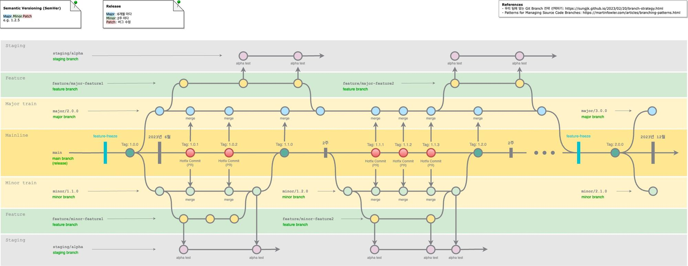
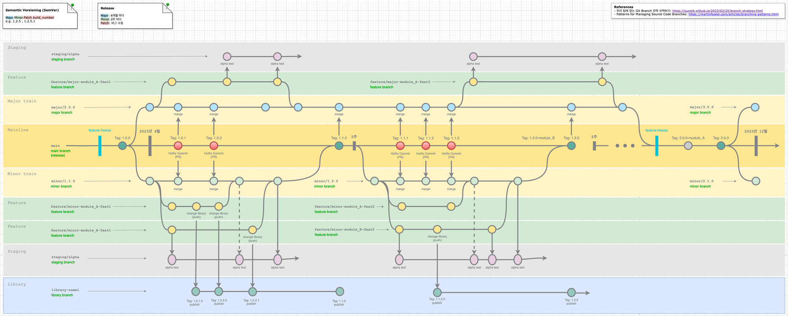
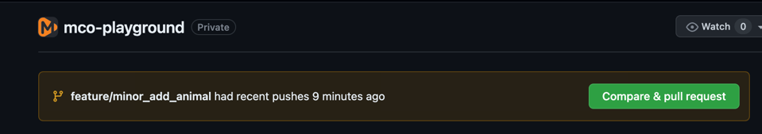
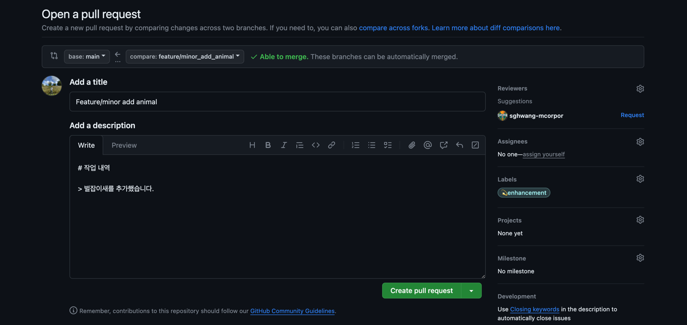

# 👋 mco-playground
신규 입사자들이 본 업무를 시작하기 전에 사내 컨벤션에 적응할 수 있도록 먼저 코드를 기여해 볼 수 있는 놀이터.

- [Overview](#-overview)
- [Part 1. Feature Branch](#-part-1-feature-branch)
- [Part 2. Trial Branch](#-part-2-trial-branch)
- [Part 3. Alpha or Staging Branch](#-part-3-alpha-or-staging-branch)
- [Part 4. Major & Minor Branch](#-part-4-major--minor-branch)
- [Part 5. Release Branch](#-part-5-release-branch)
- [Part 6. Bugfix](#-part-6-bugfix)
- [Finish](#-finish)
---
 

## 🔭 Overview

작업 진행 시 기본적인 flow는 아래와 같습니다.

- 싱글 모듈

- 멀티 모듈

- 더 자세한 내용은 [Branching & Publishing](https://www.notion.so/mcorporation-dev/Branching-Publishing-350bb7baba4645f3bd4d69abb92cceee?pvs=4)에서 확인 할 수 있으며, 각 단계를 차례대로 살펴보겠습니다.
- `mcorporation-dev` 에서 사용하는 `issues labels` 은 [Labels](Labels.md) 에서 확인 할 수 있습니다.

---

## 🔥 Part 1. Feature Branch

feature 브랜치는 작업 브랜치로 모든 개발자는 feature 브랜치를 생성하여 작업을 진행합니다.

작업 내용에 따라 minor 또는 major 브랜치에서 새 feature 브랜치를 생성하고 작업을 진행 합니다.

> `zoo application`에 동물을 하나 추가해 달라는 minor 기능 요청이 들어왔습니다.  
> feature 브랜치 생성 후 작업을 진행해 보세요.  
> [동물 사전](http://animal.memozee.com/animal/Dic/) 페이지에서 동물을 임의로 하나 골라 `zoo module`에 클래스 파일을 추가해 보세요.

 
 

## 🔥 Part 2. Trial Branch

작업을 진행 하다보면 `aid` 란 이름이 앞에 붙은 모듈이 있을 것 입니다.

해당 모듈은 nexus에 배포되는 모듈로 `release`되거나 `trial`로 시작되는 브랜치를 통해 배포 할 수 있습니다.

`Trial` 브랜치는 각 github repository 별로 라이브러리가 존재할 경우 만들어져 있으며

minor, major 브랜치와 마찬가지로 feature 브랜치를 머지하여 배포합니다.

feature 브랜치에서 작업하는 중간에 머지 할 수 있습니다.

`trial` 브랜치에 `push`되어 배포되는 라이브러리는 `pre-release version(x.x.x.x)` 이며 테스트 및 라이블에 배포되기 전에 사용됩니다.

만약 해당 `repository`가 `release` 가 되어 운영에 배포된다면 `release` 로 올라간 버전으로 배포가 됩니다.

> 위에서 만든 feature 브랜치에서 `aid:employee` 모듈에 직업 하나를 추가하고 배포를 진행해 보세요.  
> 배포된 버전은 [Notion page](https://www.notion.so/mcorporation-dev/mco-playground-50d7d0a8e0694c2ca3c9ee27f1a25f02?pvs=4)에서 확인 할 수 있습니다.  

 
 

## 🔥 Part 3. Alpha or Staging Branch

`alpha` 또는 `staging` 브랜치는 테스트 서버 배포용 브랜치 입니다.

`feature` 작업 후 `staging` 브랜치에 머지해서 테스트를 진행 할 수 있습니다.

`staging` 브랜치에 작업한 `feature` 브랜치를 머지하면 바로 배포가 진행 됩니다.

> [Part 1](#-part-1-feature-branch) 에서 작업한 `feature` 브랜치를 `alpha(or staging)`에 머지해 주세요.

 
 

## 🔥 Part 4. Major & Minor Branch

`major`와 `minor` 브랜치는 머지 브랜치로 이 두 브랜치에서는 머지만 진행합니다.

`feature`에 브랜치에서 작업 진행 후 작업 내용에 따라 `major` 또는 `minor` 브랜치에 `pull request`를 작성합니다.

`feature`를 처음 생성하여 push 할 경우 아래 이미지처럼 `Compare & pull request` 버튼이 생깁니다.

만약 생기지 않았다면 `Pull requests` 탭으로 들어가 작성합니다.

`pull request`를 작성 할 때 작업에 해당되는 [Label](Labels.md)을 추가합니다.

> [Part 1](#-part-1-feature-branch) 에서 작업한 feature 브랜치로 minor에 `pull request`를 작성해 주세요.

 
 

## 🔥 Part 5. Release Branch

스프린트가 종료되면 `minor` 또는 `major`에 내용을 `release branch`에 머지하면서 작업한 내용이 운영에 반영 됩니다.

`release branch`는 `main` 브랜치를 사용하고 있고 직접적으로 머지 할 수 없으며, `pull request`를 통해 머지를 진행해야 합니다.

`minor` 또는 `major`와 마찬가지로 `Label`을 추가해야합니다.

> [Part 4](#-part-4-major--minor-branch) 에서 머지한 내용으로 `pull request` 를 작성해 주세요.

 
 

## 🔥 Part 6. Bugfix

`Bugfix`는 `main` 브랜치에서 브랜치를 만들어 바로 적용해야 합니다.

이슈가 발생되고 이슈에 담당자로 배정되면 `main` 브랜치에서 `bugfix` 브랜치를 생성하여 작업을 진행하

`staging` 브랜치에 머지 또는 `pull request` 를 요청하여 테스트를 진행합니다.

문제가 없다면 `main` 브랜치에 `pull request` 를 요청하여 배포를 합니다.

> [Part 1](#-part-1-feature-branch) 에서 추가한 동물이 국가보호종으로 지정되어 동물원에 존재하면 안되며 신고당하기전에 해당 동물을 제거해야 합니다.  
> `bugfix` 브랜치를 생성하여 작업을 진행하고 `main` 브랜치에 `pull request`를 작성해 주세요.

 
 

## 🚀 Finish

pr을 작성하면 담당자가 merge를 하게 되고 서버에 배포가 되면서 운영에 반영이 됩니다.

배포된 버전은 [Notion page](https://www.notion.so/mcorporation-dev/mco-playground-50d7d0a8e0694c2ca3c9ee27f1a25f02?pvs=4)에서 확인 할 수 있습니다.
