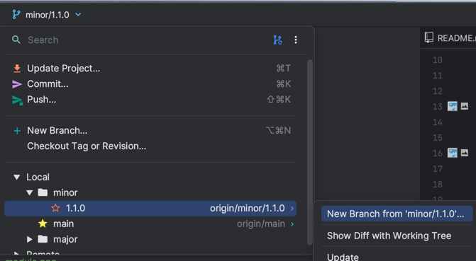

# 👋 mco-playground
신규 입사자들이 본 업무를 시작하기 전에 사내 컨벤션에 적응할 수 있도록 먼저 코드를 기여해 볼 수 있는 놀이터.

```
  _   _      _ _         __  __  ____                                 _   _               _ 
 | | | | ___| | | ___   |  \/  |/ ___|___  _ __ _ __   ___  _ __ __ _| |_(_) ___  _ __   | |
 | |_| |/ _ \ | |/ _ \  | |\/| | |   / _ \| '__| '_ \ / _ \| '__/ _` | __| |/ _ \| '_ \  | |
 |  _  |  __/ | | (_) | | |  | | |__| (_) | |  | |_) | (_) | | | (_| | |_| | (_) | | | | |_|
 |_| |_|\___|_|_|\___/  |_|  |_|\____\___/|_|  | .__/ \___/|_|  \__,_|\__|_|\___/|_| |_| (_)
                                               |_|                                          
```


- [Overview](#-overview)
- [Part 1. Feature Branch](#-part-1-feature-branch)
- [Part 2. Library Branch](#-part-2-library-branch)
- [Part 3. Alpha or Staging Branch](#-part-3-alpha-or-staging-branch)
- [Part 4. Major & Minor Branch](#-part-4-major--minor-branch)
- [Part 5. Release Branch](#-part-5-release-branch)
- [Part 6. Bugfix](#-part-5-release-branchmain)
- [Finish](#-finish)
---
<br/>

## 🔭 Overview

작업 진행 시 기본적인 flow는 아래와 같습니다.

- 싱글 모듈


- 멀티 모듈


- 더 자세한 내용은 노션 페이지에서 확인 할 수 있으며, 각 단계를 차례대로 살펴보겠습니다.
- [Branching & Publishing](https://www.notion.so/mcorporation-dev/Branching-Publishing-350bb7baba4645f3bd4d69abb92cceee?pvs=4)

---


## 🔥 Part 1. Feature Branch

feature 브랜치는 작업 브랜치로 모든 개발자는 feature 브랜치를 생성하여 작업을 진행합니다.

작업 내용에 따라 minor 또는 major 브랜치에서 새 feature 브랜치를 생성하고 작업을 진행 합니다.




> feature 브랜치 생성 후 작업을 진행해 보세요.


<br/>
<br/>

## 🔥 Part 2. Library Branch

작업을 진행 하다보면 `aid` 란 이름이 앞에 붙은 모듈이 있을 것 입니다.

해당 모듈은 nexus에 배포되는 모듈로 라이브러리 브랜치를 통해 배포 할 수 있습니다.

라이브러리 브랜치는 각 github repository 별로 라이브러리가 존재할 경우 만들어져 있으며

minor, major 브랜치와 마찬가지로 feature 브랜치를 머지하여 배포합니다.

feature 브랜치에서 작업하는 중간에 머지 할 수 있습니다.

> 위에서 만든 feature 브랜치에서 `aid` 모듈에 작업 진행 후 라이브러리 브랜치에 머지하여 배포해 주세요.


<br/>
<br/>

## 🔥 Part 3. Alpha or Staging Branch

alpha 또는 staging 브랜치는 테스트 서버 배포용 브랜치 입니다.

feature 작업 후 staging 브랜치에 머지해서 테스트를 진행 할 수 있습니다.

staging 브랜치에 작업한 feature 브랜치를 머지하면 바로 배포가 진행 됩니다.

> [Part 1](#-part-1-feature-branch) 에서 작업한 feature 브랜치를 alpha(or staging)에 머지해 주세요.


<br/>
<br/>


## 🔥 Part 4. Major & Minor Branch

major와 minor 브랜치는 머지 브랜치로 이 두 브랜치에서는 머지만 진행합니다.

feature에 브랜치에서 작업 진행 후 작업 내용에 따라 major 또는 minor 브랜치에 머지를 합니다.

> [Part 1](#-part-1-feature-branch) 에서 작업한 feature 브랜치를 minor에 머지해 주세요.


<br/>
<br/>

## 🔥 Part 5. Release Branch

스프린트가 종료되면 minor 또는 major에 내용을 `release branch`에 머지하면서 작업한 내용이 운영에 반영 됩니다.

`release branch`는 `main` 브랜치를 사용하고 있고 직접적으로 머지 할 수 없으며, pull request를 통해 머지를 진행해야 합니다.

> [Part 4](#-part-4-major--minor-branch) 에서 머지한 내용으로 pull request 를 작성해 주세요.


<br/>
<br/>

## 🔥 Part 6. Bugfix

`Bugfix`는 `main` 브랜치에서 브랜치를 만들어 바로 적용해야 합니다.

이슈가 발생되고 이슈에 담당자로 배정되면 main 브랜치에서 feature 브랜치를 생성하여 작업을 진행하

staging 브랜치에 머지 또는 pull request를 요청하여 테스트를 진행합니다.

문제가 없다면 main 브랜치에 pull request를 요청하여 배포를 합니다.

> [Part 5](#-part-5-release-branchmain) 에서 작업한 내용에 버그가 발생했습니다! 해당 내용을 수정하여 pull request 를 요청해 주세요


<br/>
<br/>

## 🚀 Finish

pr을 작성하면 담당자가 merge를 하게 되고 서버에 배포가 되면서 운영에 반영이 됩니다.


